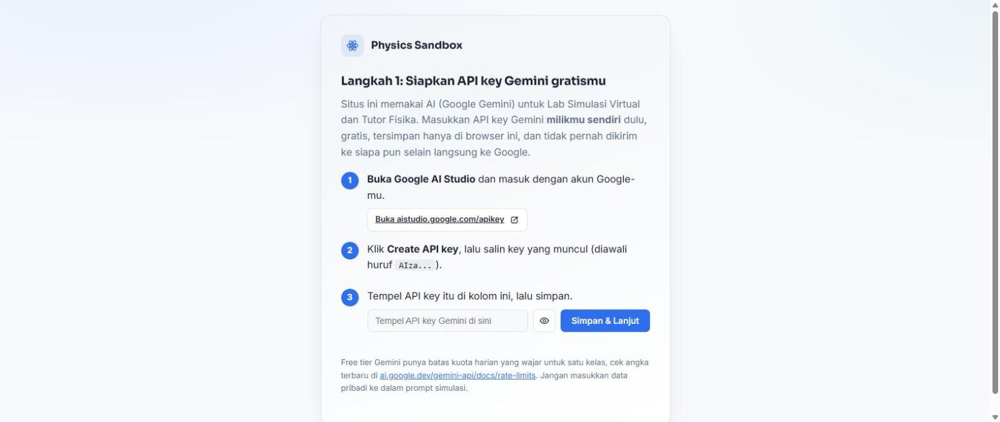
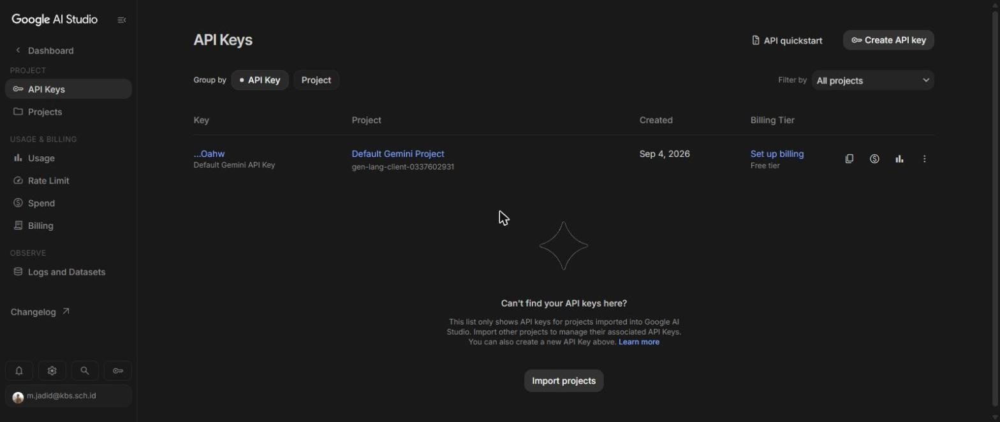
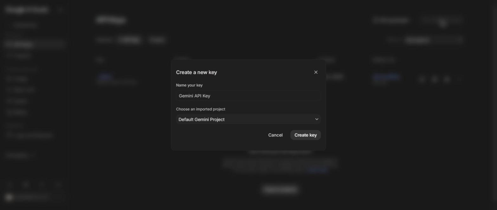

# Physics Sandbox - Platform Belajar & Lab Simulasi Fisika (AS/A Level Cambridge 9702)

Platform pembelajaran fisika berbasis web yang berisi:

- **Materi Belajar** per topik (rumus, penjelasan, tabel, foto dan video penjelasan yang relevan).
- **Eksperimen** nyata: praktikum fisik yang bisa dilakukan langsung di kelas/lab (tujuan, konsep, alat & bahan, langkah kerja, cara analisis data, keselamatan kerja, sampai pertanyaan diskusi), bukan simulasi komputer.
- **Latihan Soal** dengan pembahasan lengkap yang bisa disembunyikan/ditampilkan.
- **Lab Simulasi Virtual**: siswa mengisi *generator prompt terstruktur*, lalu AI (Google Gemini) menuliskan kode simulasi fisika HTML yang langsung tampil di preview, bisa diedit, dan diunduh. Setiap pengguna memakai API key Gemini gratis miliknya sendiri (lihat bagian 3).

Semua konten disusun mengikuti **25 topik silabus Cambridge International AS & A Level Physics 9702** (lihat `CURRICULUM.md`). Topik **Kinematics** sudah diisi penuh sebagai contoh/pilot; topik lain sudah punya struktur, tinggal diisi.

---

## 1. Struktur Proyek

```
physics-sandbox/
├── index.html              -> halaman utama (satu halaman, semua topik)
├── teacher.html            -> Panel Guru (kontrol sesi kelas + monitoring roster real-time)
├── css/style.css            -> tampilan
├── js/config.js             -> URL backend AI + Kode Eksplorasi Bebas (publik, isi setelah deploy Apps Script)
├── js/content.js            -> SEMUA konten topik (materi, eksperimen, latihan soal)
├── js/demo-simulations.js   -> simulasi jadi (eksperimen Kinematics + mode demo lab)
├── js/chatbot-data.js       -> bahan Tutor Fisika per topik (acuan AI + skrip cadangan offline)
├── js/chatbot.js            -> logika Tutor Fisika (chat AI + fallback lokal)
├── js/app.js                -> logika situs utama (navigasi bertahap, tab, generator prompt, sesi kelas, dsb.)
├── js/teacher.js            -> logika Panel Guru
├── apps-script/Code.gs      -> backend relay ke Gemini API + koordinasi sesi kelas (dipasang terpisah di Google Apps Script)
├── README.md                -> file ini
└── CURRICULUM.md            -> peta 25 topik + status pengisian konten
```

---

## 2. Menjalankan/deploy situs dengan GitHub Pages (gratis)

1. Buat akun GitHub (jika belum ada) di https://github.com.
2. Buat repository baru, misalnya `physics-sandbox` (boleh publik atau privat, Pages gratis untuk publik; untuk privat butuh GitHub Pro/organisasi sekolah, biasanya guru bisa cek dulu apakah sekolah punya GitHub Education).
3. Upload semua isi folder `physics-sandbox/` ke repo tersebut (bisa lewat web GitHub: "Add file" -> "Upload files", atau lewat `git push` jika terbiasa command line).
4. Masuk ke **Settings -> Pages** pada repo tersebut.
5. Pada **Branch**, pilih `main` dan folder `/root`, lalu **Save**.
6. Tunggu 1-2 menit, GitHub akan memberi URL seperti `https://<username>.github.io/physics-sandbox/`. Itulah alamat platform kamu, bisa dibagikan ke siswa.
7. Setiap kali mengedit file (menambah topik baru, dsb.), cukup upload ulang / commit, situs otomatis update dalam 1-2 menit.

> **Update konten tanpa coding berat**: sebagian besar pekerjaan menambah topik hanya mengedit `js/content.js` (menambah teks/HTML), tidak perlu menyentuh file lain.

---

## 3. Mengaktifkan AI generator (tab Lab Simulasi Virtual), GRATIS pakai Gemini

Situs GitHub Pages bersifat statis (tidak bisa menyimpan API key dengan aman sendiri), jadi kita pakai **Google Apps Script sebagai backend/perantara** yang aman untuk memanggil **Google Gemini API**. Gemini dipilih karena punya **free tier sungguhan** (tidak seperti Claude/OpenAI yang berbayar per pemakaian), cocok untuk dipakai banyak pengguna tanpa biaya.

**Penting, arsitektur API key:** backend (Apps Script) di proyek ini TIDAK menyimpan API key siapa pun. Setiap pengguna situs (guru maupun siswa) memasukkan API key Gemini **milik mereka sendiri**, dipandu langkah demi langkah langsung di halaman Beranda situs (dan bisa diubah lagi kapan saja lewat tombol **Pengaturan** di header). Key itu tersimpan hanya di browser pengguna masing-masing (localStorage) dan dikirim langsung ke Google setiap kali mereka menekan Generate, tidak pernah melewati atau disimpan di server pengelola situs. Keuntungannya:

- Pengelola/deployer situs tidak perlu membayar atau menyediakan kuota API untuk semua orang yang memakai situs.
- Setiap pengguna memakai kuota gratis Gemini miliknya sendiri.
- Tidak ada API key developer yang tersimpan di server dan perlu dijaga kerahasiaannya.

**Langkah setup backend relay (dilakukan sekali oleh pengelola situs, gratis):**

1. Buka https://script.google.com -> **New project**.
2. Hapus kode contoh, salin-tempel seluruh isi file `apps-script/Code.gs` dari proyek ini.
3. Klik **Deploy -> New deployment** -> pilih tipe **Web app**.
   - **Execute as:** Me
   - **Who has access:** Anyone
4. Klik **Deploy**, salin URL yang diakhiri `/exec`. URL ini BUKAN rahasia (tidak berisi API key siapa pun), aman dipublikasikan di kode situs.
5. Buka `js/config.js` di repo GitHub kamu, isi:
   ```js
   const DEFAULT_BACKEND_URL = "https://script.google.com/macros/s/XXXXXXXX/exec";
   ```
6. Commit & push perubahan itu. Semua pengguna yang membuka situs otomatis terhubung ke relay AI ini (mereka tetap perlu memasukkan API key Gemini pribadi masing-masing, lihat di bawah).

**Testing cepat tanpa commit ke repo:** klik tombol **Pengaturan** di situs, buka bagian "Pengaturan lanjutan", lalu tempel URL Web App di sana, tersimpan di browser kamu saja (untuk uji coba sebelum di-commit untuk semua orang).

**Bagaimana pengguna (guru/siswa) mendapatkan API key mereka sendiri:** situs memandu ini otomatis di halaman Beranda: buka https://aistudio.google.com/apikey, login dengan akun Google, klik **Create API key** (gratis), lalu tempel key itu di kolom yang disediakan di halaman Beranda atau di tombol Pengaturan. *(Free tier ada batas kecepatan/kuota harian, cek angka terbaru di https://ai.google.dev/gemini-api/docs/rate-limits karena bisa berubah. Untuk pemakaian satu orang/kelas biasanya sudah cukup.)*

**Gambar langkah demi langkah (untuk dipandu ke siswa/guru):**

| Langkah 1 - Panel "Siapkan API key" di halaman Beranda situs | Langkah 2 - Halaman API Keys Google AI Studio | Langkah 3 - Dialog "Create a new key" |
| --- | --- | --- |
|  |  |  |
| Klik link **Buka aistudio.google.com/apikey** di panel ini (langkah 1 di situs). | Setelah login Google, buka menu **API Keys** - tombol **Create API key** ada di kanan atas (kalau sudah pernah bikin key sebelumnya, key lama juga tampil di sini, disamarkan seperti `...Oahw`). | Beri nama bebas, pilih project (boleh biarkan default), klik **Create key**. Key baru (diawali `AIza...`) langsung tampil - salin, lalu tempel ke kolom "Tempel API key Gemini di sini" di situs (langkah 3), klik **Simpan & Lanjut**. |

**Jika API key belum diisi**, tab Lab Simulasi Virtual tetap menawarkan **Mode Demo** (tombol "Coba Mode Demo"): menampilkan simulasi contoh yang sudah disiapkan (bukan hasil AI sungguhan sesuai prompt), supaya pengguna tetap bisa mencoba alurnya sebelum menyiapkan API key.

**Catatan privasi**: pada free tier Gemini, Google boleh memakai isi prompt/output untuk peningkatan produk mereka (ini kebijakan standar layanan gratis mereka, cek detail terbaru di halaman pricing/data policy Gemini API). Wajar untuk prompt simulasi fisika, tapi ingatkan siswa untuk tidak memasukkan data pribadi ke dalam prompt.

**Mau ganti ke Claude nanti?** Bisa, tinggal ganti bagian yang memanggil API di `Code.gs` (endpoint, format request/response, dan cara membaca API key dari body permintaan) mengikuti dokumentasi di docs.claude.com; struktur proxy & sisi front-end tidak perlu diubah sama sekali.

### Troubleshooting koneksi AI

- **Error CORS di console browser**: pastikan front-end mengirim `Content-Type: text/plain` (sudah begitu di `app.js`), jangan diubah ke `application/json`, karena Apps Script tidak bisa menjawab *preflight request* dengan benar.
- **"API key Gemini belum diisi"**: pengguna perlu memasukkan API key pribadinya dulu lewat halaman Beranda atau tombol Pengaturan.
- **"API key ditolak Google"**: API key yang dimasukkan salah, sudah dihapus, atau bukan API key Gemini yang valid, minta pengguna membuat/menyalin ulang dari https://aistudio.google.com/apikey.
- **Deployment lama masih terpanggil**: setiap edit `Code.gs`, buat deployment versi baru lewat **Manage deployments**.
- **Respons AI terlalu panjang/terpotong (finishReason MAX_TOKENS)**: naikkan `MAX_OUTPUT_TOKENS` di `Code.gs` (defaultnya 48000), atau minta kompleksitas visual yang lebih rendah di prompt.
- **"Permintaan diblokir oleh filter keamanan Gemini"**: ubah kata-kata di prompt (jarang terjadi untuk topik fisika, tapi filter otomatis kadang terlalu sensitif terhadap kata tertentu).
- **Animasi/perhitungan di preview tidak jalan, atau tombol "Lihat Kode" menampilkan kode yang terlihat tidak lengkap**: hasil AI generatif tidak selalu 100% sempurna di setiap percobaan, situs otomatis mendeteksi hasil yang jelas rusak/terpotong (HTML tidak diakhiri `</html>`, tidak ada `<script>`, atau kurung kurawal tidak seimbang) dan menampilkan peringatan supaya kamu tahu harus generate ulang, bukan diam-diam menampilkan simulasi yang rusak. Kalau muncul peringatan ini (atau animasinya memang tidak berjalan meski tidak ada peringatan), coba klik **Generate** sekali lagi, cukup sering hasil berikutnya sudah benar, atau sederhanakan permintaan di prompt (kurangi jumlah grafik/kontrol sekaligus). Banyak simulasi juga sengaja perlu diklik tombol **"Mulai Simulasi"** di dalam preview dulu sebelum animasinya berjalan (ini disengaja, bukan bug, supaya siswa bisa atur variabel dulu sebelum menjalankan).

---

## 4. Navigasi bertahap, Tutor Fisika (chatbot), dan Panel Guru

Fitur-fitur ini butuh **satu langkah redeploy Apps Script** (lihat Bagian 3) supaya aktif, karena `apps-script/Code.gs` menambahkan mode `chat`, `session_sync`, `teacher_session`, `teacher_roster`, `gate_submit`, `gate_status`, `teacher_gate_decide`, `quiz_bank_get`, `quiz_bank_save`, `quiz_publish`, `quiz_unpublish`, `quiz_results`, `quiz_submit`, dan `quiz_generate` di server. Kalau kamu sudah pernah deploy sebelumnya: buka https://script.google.com, buka project-nya, klik **Deploy -> Manage deployments -> Edit (ikon pensil) -> Version: New version -> Deploy**. URL `/exec` tetap sama, tidak perlu ganti `js/config.js` lagi.

**Navigasi bertahap per topik (sintaks PjBL) + konfirmasi guru di titik kritis.** Siswa boleh mulai dari topik mana saja (tidak perlu urut dari topik 1), tapi di dalam satu topik, empat tab (Materi -> Eksperimen -> Latihan Soal -> Lab Simulasi) tetap harus dibuka berurutan - sekarang mengikuti sintaks **Project-Based Learning (PjBL)** (bukan lagi Inquiry Learning), supaya cocok untuk proyek fisika yang berjalan lintas 2-3 pertemuan: Materi = Penentuan Pertanyaan Mendasar & Perencanaan Proyek, Eksperimen = Mendesain Perencanaan Proyek/Menyusun Jadwal/Memonitor Kemajuan, Latihan Soal = Penguatan Konsep, dan Lab Simulasi = Menguji Hasil & Mengevaluasi Pengalaman. Label tahap PjBL ini tampil otomatis di atas tiap tab (lihat `PJBL_STAGE_LABELS` di `js/app.js`).

Supaya "next" antar tab bukan cuma klik kosong, tiap tab sekarang punya **pertanyaan konfirmasi pemahaman** (didefinisikan lewat `topic.materiCheck`/`topic.eksperimenCheck` di `js/content.js`, dinilai otomatis di klien):
- **Materi -> Eksperimen**: siswa jawab **5 soal pilihan ganda** yang mencakup keseluruhan materi topik itu, dinilai sebagai **skor** (bukan harus benar semua) - butuh **minimal 80%** (4 dari 5 benar; ambang ini diatur lewat `PASS_THRESHOLD_MATERI` di `js/app.js`) untuk lanjut, **tanpa** perlu konfirmasi guru. Kalau skor masih di bawah 80%, jendela konfirmasi TIDAK menutup/lanjut - siswa diminta menutup jendela itu, mempelajari kembali Materi Belajar di atas, lalu klik **Next** lagi untuk mencoba ulang (kelima soal yang sama akan muncul lagi, dalam urutan tetap sesuai `topic.materiCheck`).
- **Eksperimen -> (Latihan Soal + Lab Simulasi)**: siswa jawab 2 pertanyaan tentang hubungan antar-variabel & pengelolaan data eksperimen. Kalau semua benar, permintaan **dikirim ke guru** (lewat mode backend `gate_submit`/`gate_status`) dan siswa menunggu (banner "Menunggu konfirmasi guru..." + polling otomatis tiap ~10 detik). Begitu guru menyetujui dari Panel Guru, **Latihan Soal dan Lab Simulasi Virtual sama-sama terbuka sekaligus** - guru cukup konfirmasi satu kali di titik ini.
- **Latihan Soal -> Lab Simulasi**: langsung next, tanpa pertanyaan maupun konfirmasi guru sama sekali.
- **Lab Simulasi (checkpoint kedua/terakhir)**: setelah menghasilkan simulasi, siswa menulis refleksi singkat (validasi apakah simulasinya sesuai konsep fisika topik itu) di bagian bawah tab Lab, lalu kirim untuk konfirmasi guru (mode `gate_submit` juga, stage `lab`) - dipakai guru untuk menandai topik itu benar-benar selesai.

Kalau guru **menolak** salah satu permintaan (lewat Panel Guru), siswa melihat catatan guru (opsional) di banner dan bisa langsung coba lagi (tombol "Coba Lagi" membuka ulang pertanyaan/form refleksinya). Semua status pending/approved/rejected di-cache di `localStorage` supaya UI tidak kosong sebelum polling pertama selesai atau saat offline sebentar.

Guru bisa membagikan **Kode Eksplorasi Bebas** (`TEACHER_UNLOCK_CODE` di `js/config.js`, publik/tidak rahasia) ke siswa yang perlu menjelajah tanpa urutan (dan tanpa gate/konfirmasi guru sama sekali), misalnya untuk eksplorasi mandiri di rumah.

**Prompt lanjutan di Lab Simulasi.** Setelah simulasi pertama jadi, siswa bisa menulis instruksi edit tambahan (mis. "tambahkan grafik kecepatan") yang diterapkan ke kode yang sudah ada, dibatasi maksimal 5 kali edit per simulasi (`MAX_FOLLOWUP_EDITS` di `js/app.js`) - pakai endpoint backend yang sama seperti Generate.

**Tutor Fisika (chatbot diskusi konsep).** Tombol bulat di kanan bawah setiap halaman topik. Kalau siswa sudah mengisi API key Gemini pribadinya (sama seperti Lab Simulasi), setiap pesan dikirim ke Gemini lewat mode `chat` di `Code.gs`, lengkap dengan riwayat obrolan dan bahan topik dari `js/chatbot-data.js` sebagai acuan, supaya tutor benar-benar menanggapi & mengevaluasi jawaban siswa (gaya Socratic) alih-alih cuma melanjutkan skrip tetap. Kalau API key belum diisi, tutor otomatis jatuh ke skrip tanya-jawab lokal berbasis kata kunci dari `js/chatbot-data.js` sebagai cadangan (tetap bisa dipakai, tapi kurang adaptif). Menambah/mengedit bahan topik: edit `CHATBOT_KB` di `js/chatbot-data.js`, ikuti pola topik yang sudah ada.

**Panel Guru (`teacher.html`) - sesi kelas real-time.** Buka `teacher.html` di situs kamu (mis. `https://<username>.github.io/v4/teacher.html`). Login pakai `TEACHER_CONTROL_CODE` yang didefinisikan di `apps-script/Code.gs` (**wajib diganti dari nilai default**, lalu redeploy) - kode ini tersimpan di server, tidak pernah terlihat siswa lewat "View Source" situs, beda dari `TEACHER_UNLOCK_CODE` yang memang publik. Dari panel ini guru bisa:
- Memulai sesi kelas: pilih topik + tab yang wajib dikerjakan semua siswa sekarang, dapat kode sesi acak untuk dibagikan (tulis di papan tulis).
- Siswa gabung lewat tombol Pengaturan di situs utama (bagian "Sesi Kelas"), masukkan kode itu. Begitu gabung, mereka otomatis diarahkan ke aktivitas yang ditentukan, dan **tidak bisa membuka topik/tab lain** selama sesi aktif (mengalahkan Kode Eksplorasi Bebas juga) - supaya satu kelas benar-benar mengerjakan hal yang sama secara bersamaan.
- Mengganti aktivitas kapan saja (mis. pindah dari Materi ke Eksperimen) - semua siswa yang gabung otomatis ikut pindah dalam ~12 detik (polling, bukan push notification sungguhan) tanpa perlu join ulang.
- Memantau roster siswa (ID anonim, bukan nama - mis. "Siswa-A3F9", digenerate otomatis per perangkat) beserta aktivitas & waktu lapor terakhirnya, diperbarui otomatis tiap ~8 detik.
- Mengakhiri sesi - semua siswa otomatis kembali ke mode belajar mandiri (navigasi bertahap per topik seperti biasa).
- **Konfirmasi Menunggu** (kartu baru): daftar semua siswa yang sudah menjawab benar pertanyaan konfirmasi Eksperimen atau mengirim refleksi Lab Simulasi, lengkap dengan ringkasan/refleksinya, menunggu tombol **Setujui**/**Tolak** dari guru. Diperbarui otomatis bersamaan dengan roster (~8 detik). Menolak akan menampilkan prompt catatan opsional untuk siswa (mis. bagian yang perlu diperbaiki).

Catatan: fitur ini pakai `PropertiesService` bawaan Apps Script sebagai penyimpanan (gratis, tanpa setup tambahan), jadi paling cocok untuk **satu kelas/rombel aktif dalam satu waktu**, bukan banyak kelas paralel dalam skala besar.

**Kuis Topik (kartu di Panel Guru).** Guru mengelola bank soal per topik (pilihan ganda/jawaban singkat/esai, boleh pakai notasi LaTeX `$...$` untuk rumus) lewat kartu "Kuis Topik" di `teacher.html`, lalu memublikasikan sebagian/semua soal itu ke sesi kelas yang sedang aktif:
- **Isi bank soal**: tulis manual (tombol "+ Tambah Soal Manual", ada toolbar simbol + pratinjau LaTeX langsung lewat MathJax), atau **Generate Otomatis (AI)** lewat Gemini (butuh API key Gemini pribadi guru, sama seperti Lab Simulasi) - soal digrounding dengan judul topik + lembar rumus topik itu, dan otomatis dihindarkan dari mengulang soal yang sudah ada di bank. Bank soal per topik **permanen**, tersimpan lintas sesi lewat `quiz_bank_save`/`quiz_bank_get`.
- **Publikasikan**: centang soal yang mau dipakai, klik "Publikasikan ke Sesi Aktif" (butuh sesi kelas aktif dulu). Siswa yang tergabung di sesi itu otomatis melihat tombol mengambang "Kuis" muncul di situs utama (lewat polling `session_sync` yang sama dipakai navigasi bertahap), klik untuk membuka & menjawab semua soal sekaligus, lalu kirim.
- **Hanya satu kuis aktif** dalam satu waktu (selaras dengan batasan "satu sesi kelas aktif" di atas) - mempublikasikan kuis baru otomatis menghapus jawaban kuis sebelumnya (lihat catatan lengkap di `apps-script/Code.gs`, bagian "Kuis Topik").
- **Lihat Jawaban Siswa**: tabel semua jawaban yang masuk untuk kuis yang sedang/baru saja aktif - soal mcq ditandai benar/salah otomatis, soal jawaban singkat/esai ditampilkan apa adanya untuk dinilai manual oleh guru.
- **Akhiri Kuis**: menghentikan penerimaan jawaban baru tanpa menghapus hasil yang sudah masuk (hasil tetap bisa dilihat sampai kuis berikutnya dipublikasikan).

---

## 5. Menambah topik baru

Semua 25 topik silabus sudah terdaftar di `js/content.js` (array `TOPICS`) dengan status `"soon"`. Untuk mengisi salah satu topik:

1. Buka `js/content.js`.
2. Tulis konten materi (HTML biasa, boleh pakai `$...$` untuk rumus matematika, sudah otomatis dirender oleh MathJax), eksperimen, dan latihan soal, ikuti pola pada blok `KINEMATICS_...` yang sudah ada. Gunakan helper `mediaRow(image, video)` untuk menambahkan foto (Wikimedia Commons berlisensi bebas) dan video (YouTube embed) yang relevan, ikuti contoh di `KINEMATICS_MATERI`.
3. Ubah `status: "soon"` menjadi `status: "ready"` pada topik tersebut.
4. Tempelkan konten itu ke objek topik lewat kode seperti pola `attachKinematicsContent()` di bagian bawah file (tinggal duplikasi & ganti nama).
5. (Opsional) Isi `labConcepts` topik itu supaya dropdown generator prompt lebih relevan.

Tidak perlu mengubah `app.js` atau `index.html` sama sekali.

---

## 6. Ide pengembangan lanjutan

- Menambahkan sistem akun siswa & pelacakan progres (misalnya via Google Sheets + Apps Script sebagai database ringan, atau Firebase untuk skala lebih besar).
- Menyimpan simulasi hasil karya siswa (galeri kelas), bisa memakai Google Drive API dari Apps Script.
- Menambahkan bank soal gaya Cambridge past-paper yang lebih banyak per topik.
- Rate-limiting / kuota generate AI per siswa per hari (bisa ditambahkan di `Code.gs` menggunakan `PropertiesService` atau Google Sheets sebagai pencatat pemakaian), berguna jika suatu saat kembali memakai satu API key bersama.

---

## Sumber referensi silabus

- [Cambridge International AS & A Level Physics 9702 - ringkasan topik 2025-2027 (Gamatrain)](https://gamatrain.com/blog/54/cambridge-international-as-a-level-physics-9702-syllabus-content-assessment-and-routes-for-2025-2026-and-2027)
